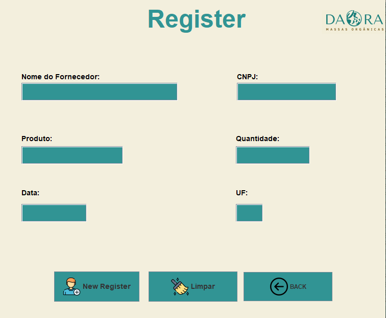
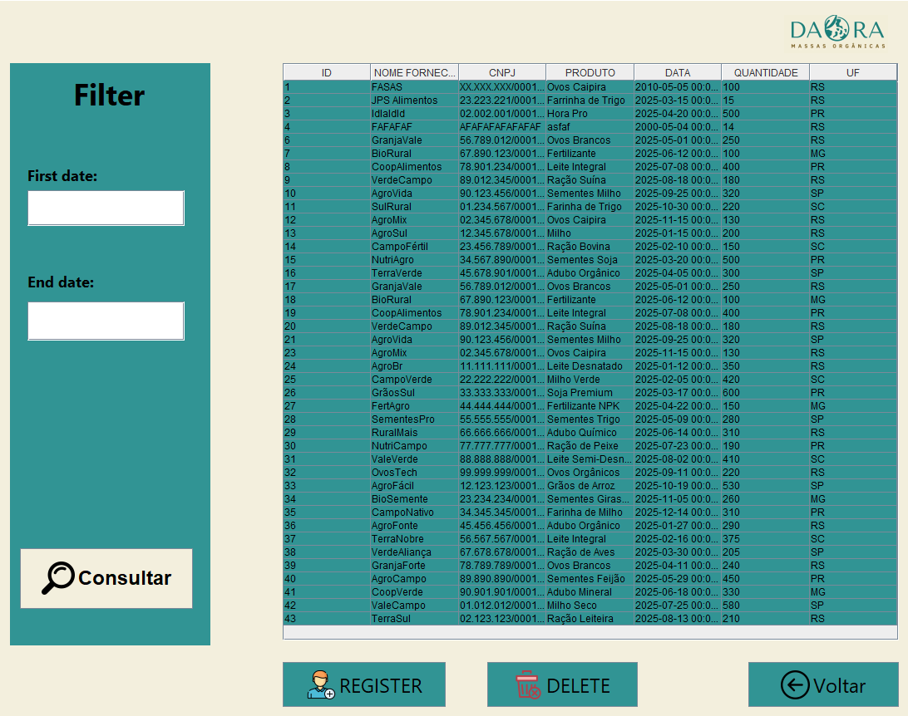
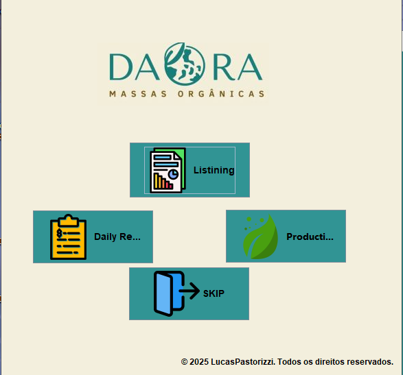

# Daora Project

Any images for Daora Project.
  

  
  

  

  

# Project Status (Finish)
 

# Technologies
-Java  
-JavaX  
-JPA  
-Hibernate  
-MySql  
-Ux/Ui
 

# Team 
-Lucas Pastorizzi
 
# Purpose of the software
The daora project was created to convey security, applicability, accessibility and also responsiveness, it was created for a pasta company, where they needed an effective system for their productivity, however with my knowledge, I developed this system for the company.
 

# System Features
-Listining  
-Security  
-Filters  
-Deletes  
-Registers  
-Login

